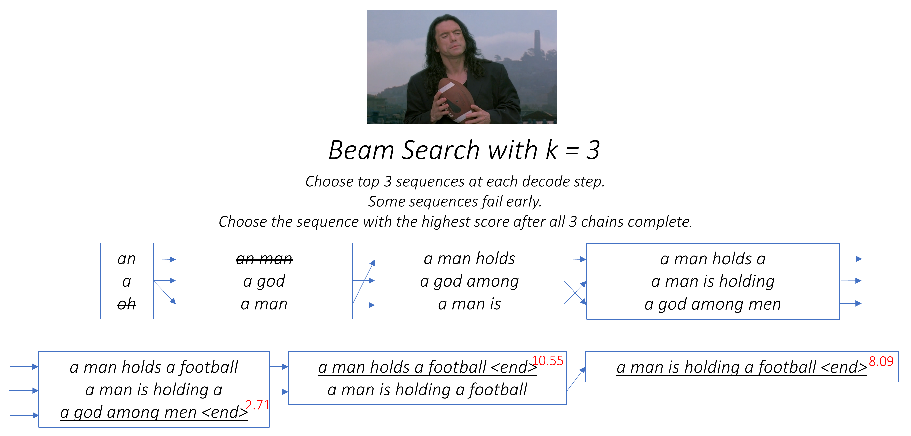

## Image Caption Generator With Beam Search

The key components of project:

- Model use the encoder-decoder based architecture. Mobilenet_v3_small used for Encoder and TransformerDecoder used for Decoder
- Preprocessing caption and build tokeizer.
- Model training and evaluation.
- Use greedy search and beam search algorithms for inference task
- Saving model weights and visualizing the results .

## About the dataset
This repository using [Flickr8k](https://www.kaggle.com/datasets/deekshithabandam/dataset-flick8k) dataset and pytorch framework. The dataset organize the files as follows:
- flickr8k
    - images
        - image files
    - captions.txt

## Inference

You can download pre-trained [best_model.pt](https://drive.google.com/file/d/1Z6v04NykpclrC_RVOmVHRMzhhHZCg7Bb/view?usp=sharing) weights and encoded images [feature_extractor.pkl](https://drive.google.com/file/d/1-5dSmo62OEkeJTFUVCR0bydPSOdUv_H7/view?usp=sharing) 

You have to change config.root path to your workspace path.

## Beam search algorithm

Beam search helps in generating the most optimal caption by considering multiple possibilities at each decoding step, rather than greedily selecting the word with the highest score. The example below demonstrates how using a beam width (k) of 3 results in better captions.

